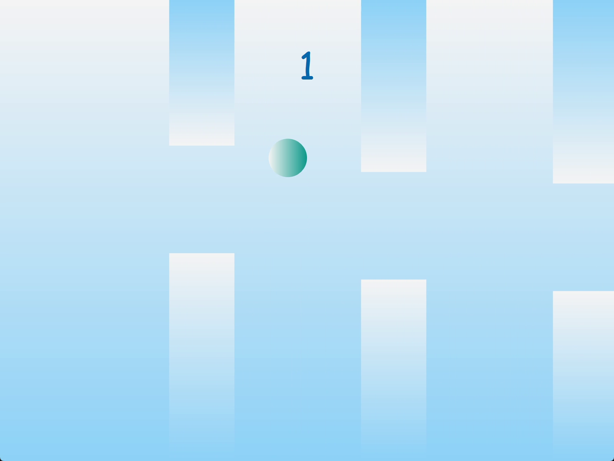
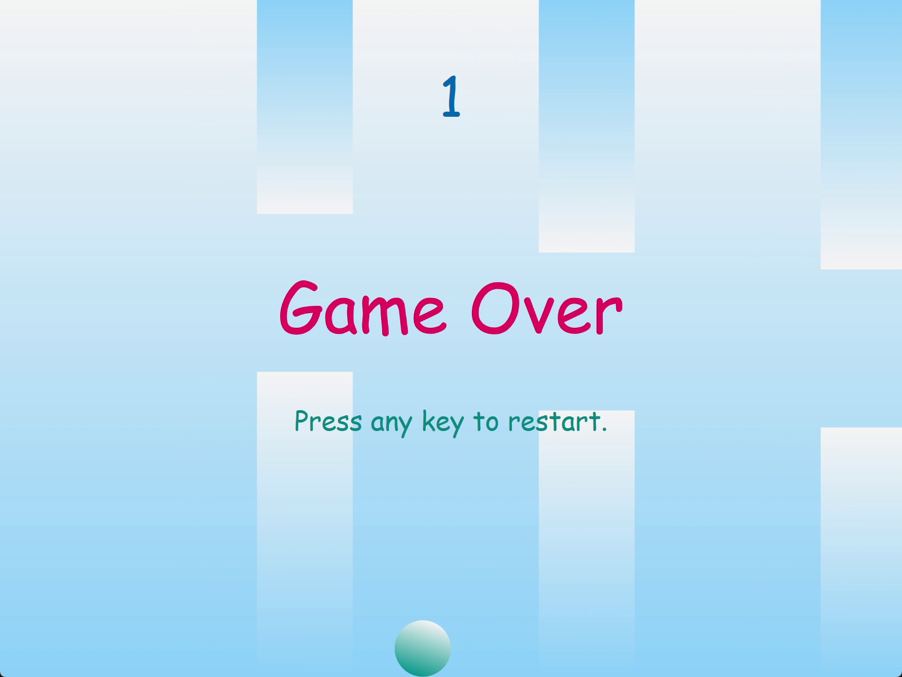

# Flappy Bird

A Flappy-Bird-like game. Real-time rendering using Direct2D and physics simulation using Box2D.





https://user-images.githubusercontent.com/39995363/187742768-bfee733d-8a68-4000-b331-033b683b91cf.mp4

---

### Controls
- Keyboard
	|||
	|-|-|
	|(Any)|Restart game|
	|Space|Fly up|

- Mouse
	|||
	|-|-|
	|(Any)|Restart game|
	|Left Button|Fly up|

---

## Minimum Build Requirements
### Development Tools
- Microsoft Visual Studio 2022

- vcpkg
	```cmd
	> git clone https://github.com/Microsoft/vcpkg
	> cd vcpkg
	> .\bootstrap-vcpkg.bat
	> .\vcpkg integrate install
	```

### Dependencies
- [Box2D](https://github.com/erincatto/box2d)
	```cmd
	> .\vcpkg install box2d
	```

## Minimum System Requirements
- OS: Microsoft Windows 10
